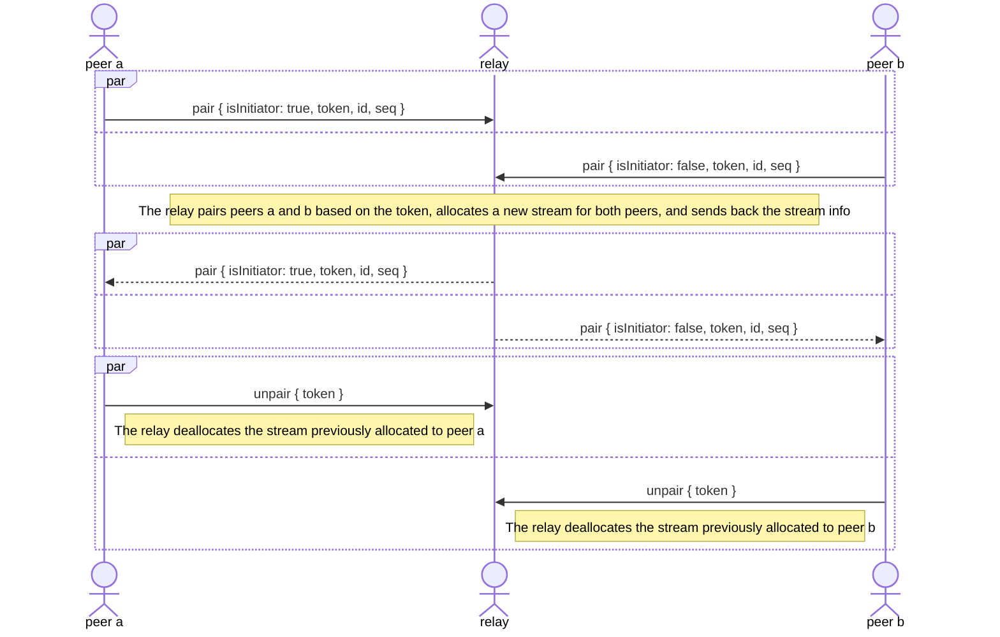

# blind-relay

Blind relay for [UDX](https://github.com/holepunchto/udx-native) over [Protomux](https://github.com/mafintosh/protomux) channels. By acting as a blind relay, a host may accept pairing requests from other hosts and relay UDX stream messages between them, similar to Traversal Using Relays around NAT (TURN).

```sh
npm i blind-relay
```

## Protocol



### Messages

All types are specified as their corresponding [compact-encoding](https://github.com/compact-encoding) codec.

#### `pair` (`0`)

1.  `bitfield(1)` Flags.
    1. `isInitiator`
2.  `fixed32` Preexchanged token.
3.  `uint` Stream ID of the sender.
4.  `uint` Initial stream sequence no. of the sender.

#### `unpair` (`1`)

1.  `bitfield(0)` Flags, reserved.
2.  `fixed32` Preexchanged token.

## License

Apache-2.0
